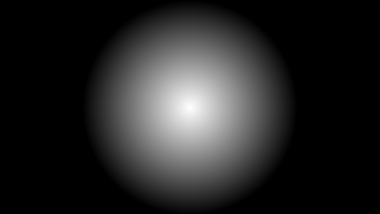

[&#8882; Previous page - Setup](0_setup.md) | [Next page - Circles grid &#8883;](1_2_circles_grid.md)
---|---

---

# 1.1. A circled light

For this shader, we have to draw a lot of circled light. So before going
further we need to understand how to draw a lonely circled light. One of the
easier way to achieve this is to use the `length(v)` builtin function. This
function returns the
[length of the vector](https://onlinemschool.com/math/library/vector/length/)
`v`. Giving the UV coordinates of the current pixel to the `length(v)`
function will return the distance between our pixel and the origin. So the
further is a point from the origin, the greater is the `length(v)` returned
value. For this script:

```glsl
void mainImage(out vec4 fragColor, in vec2 fragCoord)
{
  // Uniformize coordinate system
  vec2 UV = fragCoord / iResolution.y;

  // Compute the distance between the current pixel and the origin
  float dist = length(UV);

  // Dislay the distance value
  fragColor = vec4(vec3(dist), 1.0);
}
```

What you should see (the nearer is the point from the origin, the darker it
is):

||
|:--:|

First we need to center the result. We saw `iResolution` was the viewport
resolution. So we just uniformize this value, half it and substract it to our
pixel's UV coordinates to center the light. Finally, we have to revert the
color. To achieve this, we multiply the `length(UV)` function by `-1.0`. Now
the color value is between `0.0` and `-∞`. So if we display something,
we will see a black screen. We have to add a value to increase the maximum
color value (which is right now `0.0`). The greater will be this value, the
greater will be the maximum color value and the bigger will be our circle.
This value is our circle radius.

```glsl
void mainImage(out vec4 fragColor, in vec2 fragCoord)
{
  vec2 UV = fragCoord / iResolution.y;

  // Uniformize viewport resolution
  vec2 res = iResolution.xy / iResolution.y;

  // Half it
  res /= 2.0;

  // Substract it to the pixel's UV coordinates
  UV -= res;

  float radius = 0.5;

  // Revert color value and give a radius to the light
  float dist = radius - length(UV);

  // Multiply dist by 2.0 for better visibility
  fragColor = vec4(vec3(dist * 2.0), 1.0);
}
```

||
|:--:|

---

[&#8882; Previous page - Setup](0_setup.md) | [Next page - Circles grid &#8883;](1_2_circles_grid.md)
---|---
