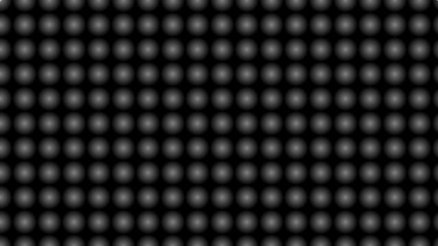

[&#8882; Previous page: A circled light](1_1_a_circled_light.md) | [Next page: Randomize the circles grid &#8883;](1_3_rd_circles_grid.md)
---|---

---

# 1.2. Circles grid

We saw in the last section of this tutorial that drawing a circle can be
done with the `length(v)` builtin function. But what if we want to draw 2
circles ? We can duplicate the `length(v)` function call. But for 3 circles ?
And for 100 circles or more ? We can not duplicate the `length(v)` function
call for each circle we need to draw. We need to find a more flexible (and
faster) way to draw our circles without comparing each pixel coordinates to
each `length(v)` call. An usual way to achieve this is to draw a grid of
primitives (here our primitive is a circle).

As mentioned in the last section of this tutorial, the `length(v)`
builtin-function returns the length of its parameter: the vector `v`. A vector
is expressed by the substraction between its 2 points. Until now, the center
of our circle was the origin. So the other point of each of our vectors was
the origin and we used `length(UV)` as a simplified version of
`length(UV - vec2(0.0))`. But now we are drawing more than 1 circle and each
of them has an unique center. For each circle, its center will be an integer
point of our viewport. We will call this point `i`. So for each pixel of our
shader we will compare it to the nearest integer:
- for `vec2 v = vec2(0.2, 5.3)`, the nearest integer to `v.x` is `0` and the
nearest integer to `v.y` is `0`. So `vec2 i = vec2(0.0, 5.0)`,
- for `vec2 v = vec2(1.7, 2.3)`, the nearest integer to `v.x` is `2` and the
nearest integer to `v.y` is `2`. So `vec2 i = vec2(2.0, 2.0)`,
- for `vec2 v = vec2(8.8, 4.6)`, the nearest integer to `v.x` is `9` and the
nearest integer to `v.y` is `5`. So `vec2 i = vec2(9.0, 5.0)`.

The `round(x)` builtin-function returns the nearest integer to `x`. This is
exactly what we need to find the center of our circles.

For this tutorial we need a 10 units height grid. First before drawing
anything, we are going to apply an unzoom to fully display this grid. After
that we have to include our new way to draw circles:

```glsl
void mainImage(out vec4 fragColor, in vec2 fragCoord)
{
  vec2 UV = fragCoord / iResolution.y;

  // Unzoom to get a 10 units height grid
  UV *= 10.;

  // Center of the circle
  vec2 center = round(UV);

  float radius = 0.5;

  float dist = radius - length(UV - center);

  fragColor = vec4(vec3(dist), 1.);
}
```

And we have a beautiful circles grid:

||
|:--:|
|For better visibility on this picture, `dist` is multiplied by 2|

---

[&#8882; Previous page: A circled light](1_1_a_circled_light.md) | [Next page: Randomize the circles grid &#8883;](1_3_rd_circles_grid.md)
---|---
