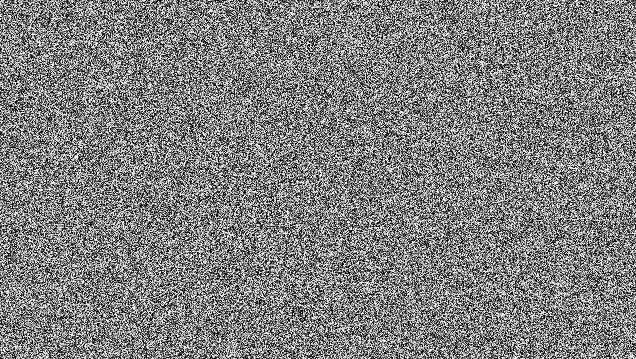
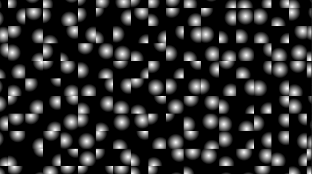

[Previous page: Circles grid &#8882;](1_2_circles_grid.md) | [&#8883; Next page: Use circled grid as a noise](1_4_noise_circles_grid.md)

---

# 1.3. Randomize the circles grid

The next step of this tutorial is to give our grid a less "well-organized"
aspect. We need to randomize some parameters (mainly radius and position of
our circles). Unfortunely, GLSL does not provide a `rand()` builtin-function.
However, many people worked on this subject to build `hash()` functions which
simulate random. For this reason we are going to pick one of them. I choosed
this one:

```glsl
uvec3 pcg3d(uvec3 v)
{
  v = v * 1664525u + 1013904223u;

  v.x += v.y * v.z;
  v.y += v.z * v.x;
  v.z += v.x * v.y;

  v ^= v >> 16u;

  v.x += v.y * v.z;
  v.y += v.z * v.x;
  v.z += v.x * v.y;

  return v;
}

float hash(vec2 s, uint hash_seed)
{
  float res;
  uvec4 u = uvec4(s, uint(s.x) ^ uint(s.y), uint(s.x) + uint(s.y));
  uvec3 p = pcg3d(uvec3(u.x, u.y, hash_seed));
  res = float(p) * (1. / float(0xffffffffu));
  return res;
}
```

Because this subject is out of the scope of this tutorial and also because I
will fail to explain what is really happening in these functions, I am not
going to try. However if you want answers, you can follow those links and come
back later:
- [How to build a hash function ?](https://nullprogram.com/blog/2018/07/31/)
- [How to evaluate a hash function ?](https://www.jcgt.org/published/0009/03/02/)
- [How PCG hash function works ?](https://www.pcg-random.org/paper.html)

I choosed this function because:
- it is a 3D function and we are working with 2D coordinates. So I can use the
Z axis to simulate the seeding of the `hash()` function,
- the "How to evaluate a hash function ?" article evalutes this `hash()`
function as a good one.

What does really matter is that you can choose the `hash()` function you want.
So if you do not like mine you can replace it by yours.

Whatever the `hash()` function you choosed (and with minor modifications),
with those lines:
```glsl
void mainImage(out vec4 fragColor, in vec2 fragCoord)
{
  fragColor = vec4(vec3(hash(fragCoord, 0u)), 1.);
}
```

This is what you should see:



Now we can use this on our grid and displace our circles:
```glsl
void mainImage(out vec4 fragColor, in vec2 fragCoord)
{
  vec2 UV = fragCoord / iResolution.y;
  UV *= 10.;

  vec2 center = round(UV);

  // Generate values between -0.5 and 0.5
  vec2 h = vec2(hash(center, 0u), hash(center, 1u)) - vec2(0.5);

  float radius = 0.5;

  // Displace the center of our circle
  float color = radius - length(UV + h - center);

  fragColor = vec4(vec3(color * 2.), 1.);
}
```

The `hash()` function generates a float between `0.0` and `1.0`. Even if it
will not change the final result, we also want to display circles' center with
negative values. So we substract `hash()` results by `0.5`. We are giving
`center` variable to the `hash()` function to displace each pixel of a circle
with the same value. We are using `hash()` function two times with two
different seed parameter (`0u` and `1u`) to displace circles center with two
different values. And here the result:



This is not really what we expected, so what is happening ?

---

[Previous page: Circles grid &#8882;](1_2_circles_grid.md) | [&#8883; Next page: Use circled grid as a noise](1_4_noise_circles_grid.md)
