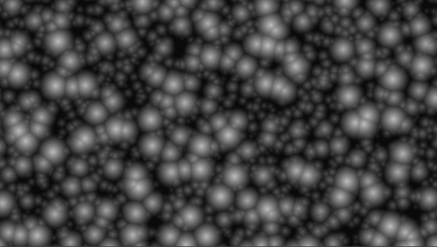

[&#8882; Previous page: Randomize the circles grid](1_3_rd_circles_grid.md) | [Next page: Shape the circles grid &#8883;](1_5_shape_circles_grid.md)
---|---

---

# 1.4. Parametrize circles grid

Now we found a way to display a lot of circles. But it is not enough. We have
to make this script parametrable to use it as a function. For now our script
is not easily readable or reusable. The goal is:
- avoiding some headaches when reading what we done,
- to help us when drawing another circles grid.

Here is our new `circles()` function:

```glsl
float circles(vec2 UV, float r, uint seed)
{
  vec2 center = round(UV);
  vec2 cell_center;
  vec2 displacement;
  float radius;
  float dist = 0.0;

  for (int x = -1; x <= 1; x++)
  {
    for (int y = -1; y <= 1; y++)
    {
      cell_center = center + vec2(x, y);
      displacement = vec2(hash(cell_center, seed), hash(cell_center, seed + 1u)) - vec2(0.5);
      radius = r / 2.0 + hash(cell_center, seed + 2u) * r;
      dist = max(dist, radius - length(UV + displacement - cell_center));
    }
  }

  return dist;
}
```

There are nothing new in this function except the 2 new parameters:
- `r` allows us to control circles radius without manipulating `UV`,
- `seed` to select a new "random" circles grid.

Now the main idea is to use the method described in this
[article](https://iquilezles.org/www/articles/fbmsdf/fbmsdf.htm) to write a
new function which will use our newly written `circles()` function:

```glsl
float fbmCircles(vec2 UV, uint seed)
{
  float strength = 1.;
  float new;
  float dist = -1.;
  uint octaves = 2u;
  for (uint i = 0u; i < octaves; i++)
  {
    // Evaluate new octave
    new = strength * circles(UV, 0.5, seed + i);

    // Add
    dist = smax(dist, new, 0.3 * strength);

    // Prepare new octave
    UV *= 2.;
    strength *= 0.5;
  }
  return dist;
}
```

What those lines are just doing is adding a new circles grid with smaller
radius after each looping:

||
|:--:|

Here the `smax()` function used by `fbmCircles()` function:

```glsl
float smax(float a, float b, float k)
{
  float h = max(k - abs(a - b), 0.);
  return max(a, b) + h * h * 0.25 / k;
}
```

You can find more details about this function in this
[article](https://iquilezles.org/www/articles/smin/smin.htm). This new
function allow us to smooth intersections between circles:

|||
|:--:|:--:|
| with `max()` | with `smax()` |

This is why we are going to include also this new function in `circles()`
function instead of `max()` usage. We are going to replace this line:

```glsl
      dist = max(dist, radius - length(UV + displacement - cell_center));
```

with this line:

```glsl
      dist = smax(dist, radius - length(UV + displacement - cell_center), 0.3);
```

With those 3 new functions, drawing circles can be achieved with only some
calls. Here is our new `mainImage()` function:

```glsl
void mainImage(out vec4 fragColor, in vec2 fragCoord)
{
  vec2 UV = 10.0 * fragCoord / iResolution.y;

  // Draw 2 layers of circles grid
  float dist = max(fbmCircles(UV, 0u), fbmCircles(UV, 5u));

  fragColor = vec4(vec3(dist), 1.0);
}
```

And the expected result:

||
|:--:|

And that is it: we drew more circles than before but with a smaller
`mainImage()` function. Drawing a circles grid is now as simple as calling the
related function !

---

[&#8882; Previous page: Randomize the circles grid](1_3_rd_circles_grid.md) | [Next page: Shape the circles grid &#8883;](1_5_shape_circles_grid.md)
---|---
