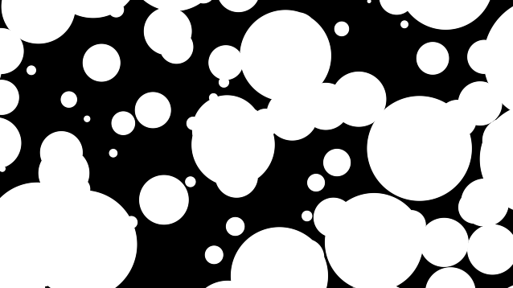
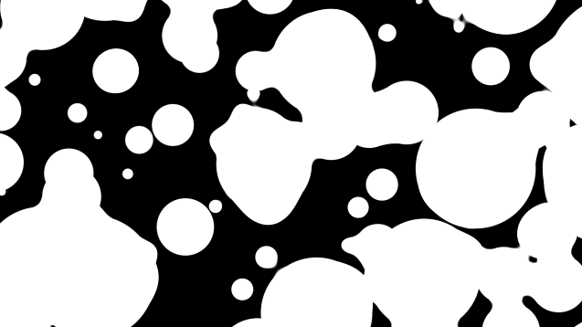

[&#8882; Previous page: Randomize the circles grid](1_3_rd_circles_grid.md) | [Next page: Shape the circles grid &#8883;](1_5_shape_circles_grid.md)
---|---

---

# 1.4. Parametrize circles grid

Now we have an easy way to display a lot of circles. But it is not enough.
We have to make this script parametrable to use it as a function. The goal is
to reuse this easily because we will draw more circles that we are drawing.
Here is our new `circles()` function:

```glsl
float circles(vec2 UV, float r, uint seed)
{
  vec2 center = round(UV);
  vec2 cell_center;
  vec2 displacement;
  float radius;
  float dist = 0.0;

  for (int x = -1; x <= 1; x++)
  {
    for (int y = -1; y <= 1; y++)
    {
      cell_center = center + vec2(x, y);
      displacement = vec2(hash(cell_center, seed), hash(cell_center, seed + 1u)) - vec2(0.5);
      radius = r / 2.0 + hash(cell_center, seed + 2u) * r;
      dist = max(dist, radius - length(UV + displacement - cell_center));
    }
  }

  return dist;
}
```

This function has 2 new parameters:
- `r` allows us to control circles radius without manipulating `UV`,
- `seed` to draw a new "random" circles grid.

Now the main idea is to use the method described in this
[article](https://iquilezles.org/www/articles/fbmsdf/fbmsdf.htm) to write a
new function:

```glsl
float fbmCircles(vec2 UV, uint seed)
{
  float strength = 1.;
  float new;
  float dist = -1.;
  int octaves = 2;
  for (int i = 0; i < octaves; i++)
  {
    // Evaluate new octave
    new = strength * circles(UV, 0.5, seed + uint(i));

    // Add
    dist = smax(dist, new, 0.3 * strength);

    // Prepare new octave
    UV *= 2.;
    strength *= 0.5;
  }
  return dist;
}
```

What those lines are just doing is adding a new circles grid with smaller
radius after each looping:

||
|:--:|

Here the `smax()` function used by `fbmCircles()` function:

```glsl
float smax(float a, float b, float k)
{
  float h = max(k - abs(a - b), 0.);
  return max(a, b) + h * h * 0.25 / k;
}
```

You can find more details about this function in this
[article](https://iquilezles.org/www/articles/smin/smin.htm). This allow us to
smooth intersections between circles:

|||
|:--:|:--:|
| with `max()` | with `smax()` |

---

[&#8882; Previous page: Randomize the circles grid](1_3_rd_circles_grid.md) | [Next page: Shape the circles grid &#8883;](1_5_shape_circles_grid.md)
---|---
