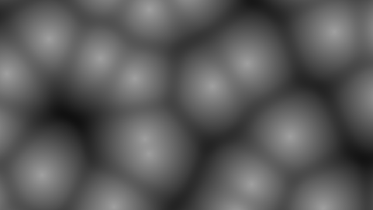
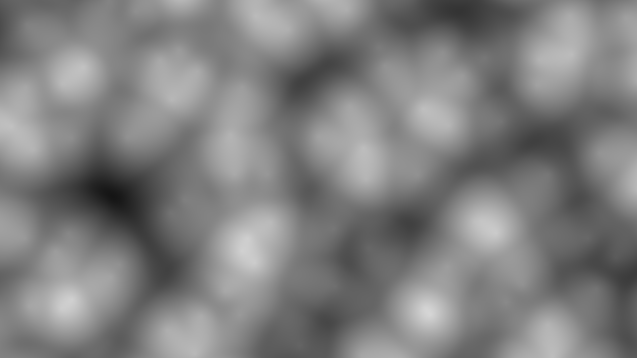
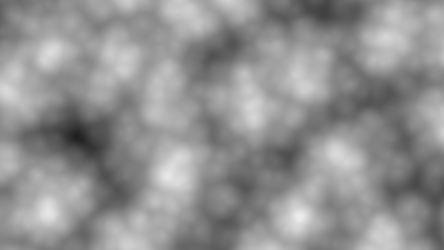
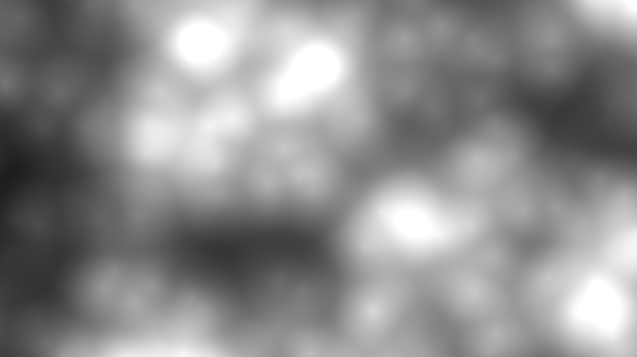

[&#8882; Previous page: Parametrize circles grid](1_4_param_circles_grid.md) | [Next page: &#8883;]()
---|---

---

# 1.5. Shape the circles grid

Ok, we drew enough circles in this tutorial ! The goal of this step is to give
the circles a cloudy shape. For this task I am going to use a voronoi pattern
because it is commonly use to draw clouds but you can use any other noise
function you want and apply same principles. Here the voronoi function we are
going to use:

```glsl
float voronoi(vec2 UV, float smoothness, uint seed)
{
  vec3 col;
  vec2 i = floor(UV);
  vec2 f = fract(UV);
  vec2 displacement;
  vec2 p;

  float dist = 8.;
  float tmp;
  float h;

  for (int x = -1; x <= 1; x++)
  {
    for (int y = -1; y <= 1; y++)
    {
      p = vec2(x, y);
      displacement = vec2(hash(i + p, seed), hash(i + p, seed + 1u));
      tmp = length(p + displacement - f);

      col = 0.5 + 0.5 * sin(hash(i + p, seed + 2u) * 2.5 + 3.5 + vec3(2.));
      h = smoothstep(0., 1., 0.5 + 0.5 * (dist - tmp) / smoothness);
      dist = mix(dist, tmp, h) - h * (1. - h) * smoothness / (1. + 3. * smoothness);
    }
  }
  return 1. - dist;
}
```

As you can see this function has some similarities with the `circles()`
function, we wrote in the last step of this tutorial. If you want more details
about what is different with the function we wrote, you can read this
[article](https://iquilezles.org/www/articles/smoothvoronoi/smoothvoronoi.htm).

As we already do in the last step of this tutorial, we are going to make a
fractional brownian motion version of this function to get a cloudy shape
looking. Below what this function is looking for different octaves:

||||
|:--:|:--:|:--:|
|1 octave|2 octaves|3 octaves|

And that is it. We do not need more octaves, this is what we are looking for:
a cloudy shape. Here the function to get this image:

```glsl
float fbmVoronoi(vec2 UV, uint seed)
{
  return voronoi(1.5 * UV, 0.3, seed) * 0.625      // first octave
    + voronoi(3. * UV, 0.3, seed + 1u) * 0.25      // second octave
    + voronoi(6. * UV, 0.3, seed + 2u) * 0.125;    // third octave
}
```

We are going to modify the `mainImage()` function we used in the last step.
First of all we are going to increase contrast of the clouds. The
`fbmVoronoi()` function returns a value between `0.0` and `1.0`. So if we
multiply the returned value by itself, more this value is near from `1.0`,
less this value should decrease:

```glsl
void mainImage(out vec4 fragColor, in vec2 fragCoord)
{
  vec2 uv = fragCoord / iResolution.y;

  float fv = fbmVoronoi(uv, 2u);

  // Increase contrast
  fv *= fv * 1.5;

  fragColor = vec4(vec3(fv), 1.0);
}
```

And this is what the clouds looks:

||
|:--:|

Our next goal is to increase light of the circles we drawn in the 1.4 section
of this tutorial. To achieve this we could add a constant like this:

```glsl
void mainImage(out vec4 fragColor, in vec2 fragCoord)
{
  vec2 UV = 10.0 * fragCoord / iResolution.y;

  float dist = max(fbmCircles(UV, 0u), fbmCircles(UV, 5u));

  dist += 0.3;

  fragColor = vec4(vec3(dist), 1.0);
}
```

But instead, we could use the `smax()` function we already used before. The
goal is to take advantage of the interpolation propriety of this function to
get a more smoothy light. For this we need to replace this line:

```glsl
  dist += 0.3;
```

by this line:

```glsl
  dist = smax(-1., dist, 3.2);
```

The `-1.0` magic number is a minimum value with what we interpolate the
circles grid.

To be faithful to the shader tutorial, we need to apply the cloudy shape on
the circles grid and reduce color number. To apply cloudy shape to the circles
grid we just need to multiply the two values between them. To reduce color
(here a color is only white intensity) number we are going to use the
`floor(v)` builtin function. This function truncates the float parameter `v`.
Let suppose we only want 4 colors in our shader. The only thing we have to do
is to apply this formula: `floor(v * COLOR_NUMBER) / COLOR_NUMBER`. So if the
`v` value is in:
- the `[0.0; 0.25[` interval, this formula will return `0.0`,
- the `[0.25; 0.5[` interval, this formula will return `0.25`,
- the `[0.5; 0.75[` interval, this formula will return `0.5`,
- the `[0.75; 1.0[` interval, this formula will return `0.75`,
And this is how we have our 4 different colors:

```glsl
void mainImage(out vec4 fragColor, in vec2 fragCoord)
{
  vec2 uv = fragCoord / iResolution.y;

  // Unzoom UV cordinates system for the circles grid
  vec2 UV = 10.0 * uv;

  // Draw the circles grid
  float dist = max(fbmCircles(UV, 0u), fbmCircles(UV, 5u));

  // Draw a cloudy shape
  float fv = fbmVoronoi(uv, 2u);

  // Increase contrast and add a little bit of light on the cloud
  fv *= fv * 1.5;

  // Add a smooth light on the circles grid
  dist = smax(-1., dist, 3.2);

  // Apply cloudy shape on the circles grid
  dist = dist * fv;

  // Reduce colors number
  dist = floor(dist * 18.) / 18.;

  fragColor = vec4(vec3(dist), 1.0);
}
```

And the last

---

[&#8882; Previous page: Parametrize circles grid](1_4_param_circles_grid.md) | [Next page: &#8883;]()
---|---
