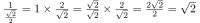

[&#8882; Previous page - Shape the circles grid](1_5_shape_circles_grid.md) | [Next page - Swirls grid &#8883;](2_2_swirls_grid.md)
---|---

---

# 2.1. A swirl

This new chapter is also a fresh start: I promise we are not going to draw
a circle. Instead we are going to draw swirls. A lot of swirls. And what we
have already done before, will really speed up the process. But before drawing
swirls, we will draw a check pattern. For this shader we will draw swirls to
displace UV coordinates so we will only see our swirls if we have something to
displace. I choosed a check pattern because it gives our swirls a nice
looking but we are not going to use this check pattern in the main result of
this tutorial so you can use any pattern you want to highlight your swirls.

Drawing a check pattern can be done with the `floor()` builtin function. I
already talk about it in the last section of this tutorial. This allow us
to split UV coordinates system into squares thanks to its integer part. To
draw squares with alternating colors we need to check `S` the sum of the two
axis of the truncated UV. If the result is even it could be white. To check
the mathematic parity of the result, we can use the `mod(v, b)` builtin
function on where `v` parameter is `S` and `b` parameter is `2.0`. If
`mod(S, 2.0)` is less than `1.0`, `S` is even, so the current pixel is white:

```glsl
void mainImage(out vec4 fragColor, in vec2 fragCoord)
{
  vec2 UV = fragCoord / iResolution.y;

  // Number of squares vertically
  float squares = 2.0;

  // Split UV cordinates system into squares
  vec2 truncated_UV = floor(UV * squares);

  // Check mathematic parity of the sum of the 2 axis of the truncated UV
  bool is_white = mod(truncated_UV.x + truncated_UV.y, 2.0) < 1.0;

  // If sum is odd, color is darker
  fragColor = vec4(vec3(0.2 + 0.2 * float(is_white)), 1.0);
}
```

This is the first version of our check pattern:

||
|:--:|

To improve this check pattern, we also want to display alternating colors for
squares' diagonals. To achieve this task, we are going to draw another check
pattern above the first one with a 45° rotation. A common way to make a
[vectorial rotation](https://en.wikipedia.org/wiki/Rotation_(mathematics)#Two_dimensions)
is to define this function:

```glsl
vec2 rotation(vec2 UV, float angle)
{
  return UV * mat2(cos(angle), -sin(angle),
                   sin(angle),  cos(angle));
}
```

Secondly, we need to find the number of squares with a size equal to the
diagonal length of a square in the first check pattern. Before computing this,
we need to find the size of a square in the second check pattern. Thanks to
the **Synchronize our viewports** part from the [0. Setup](0_setup.md) section
of this tutorial, we know that the diagonal of the square we are searching is
equal to `1.0`:

||
|:--:|

Now we only need to apply Pythagorean theorem on `ABD` isoceles right-angled
triangle:


We know that: 


We know that: 


Then, we are going to divide the vertical size of our viewport (which is
`1.0`) by the size of a square in the second check pattern and we should
find the number of squares with a size equal to the diagonal length of a
square in the first check pattern:



```glsl
void mainImage(out vec4 fragColor, in vec2 fragCoord)
{
  vec2 UV = fragCoord / iResolution.y;

  // First check pattern
  float squares = 2.0;
  vec2 truncated_UV = floor(UV * squares);
  bool is_white = mod(truncated_UV.x + truncated_UV.y, 2.0) < 1.0;

  // Number of squares with a size equal to the diagonal length of a square in the first check pattern
  squares = sqrt(2.0);

  // 45° rotation
  UV = rotation(UV, 0.7853);

  // Second ckeck pattern
  truncated_UV = floor(UV * squares);
  bool is_white2 = mod(truncated_UV.x + truncated_UV.y, 2.0) < 1.0;

  // If sum1 is even XOR sum2 is even, color is brighter
  fragColor = vec4(vec3(0.2 + 0.2 * float(is_white ^^ is_white2)), 1.0);
}
```

---

[&#8882; Previous page - Shape the circles grid](1_5_shape_circles_grid.md) | [Next page - Swirls grid &#8883;](2_2_swirls_grid.md)
---|---
