[&#8882; Previous page - Shape the circles grid](1_5_shape_circles_grid.md) | [Next page - A swirl &#8883;](2_2_a_swirl.md)
---|---

---

# 2.1. Check pattern

This new chapter is also a fresh start: I promise we are not going to draw
a circle. Instead we are going to draw swirls. A lot of swirls. And what we
have already done before, will really speed up the process. But before drawing
swirls, we will draw a check pattern. For this shader we will draw swirls to
displace UV coordinates so we will only see our swirls if we have something to
displace. I choosed a check pattern because it gives our swirls a nice
looking but we are not going to use this check pattern in the main result of
this tutorial. So you can use any pattern you want to highlight your swirls
and skip this section.

Drawing a check pattern can be done with the `floor(v)` builtin function. I
already talk about it in the last section of this tutorial. This allow us
to split UV coordinates system into squares because this function returns the
integer part of its parameter `v`. To draw squares with alternating colors we
need to check `S` the sum of the two axis of the truncated UV. If the result
is even the current pixel will be brighter otherwise it will be darker. To
check the mathematic parity of the result, we can use the `mod(v, b)` builtin
function which returns `v` modulo `b` (where `v` is `S` and `b` is `2.0`. If
`mod(S, 2.0)` is less than `1.0`, `S` is even, so the current pixel is
brighter otherwise its odd and the pixel is darker:

```glsl
void mainImage(out vec4 fragColor, in vec2 fragCoord)
{
  vec2 UV = fragCoord / iResolution.y;

  // Number of squares vertically
  float squares = 2.0;

  // Split UV cordinates system into squares
  vec2 truncated_UV = floor(UV * squares);

  // Check mathematic parity of the sum of the 2 axis of the truncated UV
  bool is_brighter = mod(truncated_UV.x + truncated_UV.y, 2.0) < 1.0;

  // If sum is odd, color is darker
  fragColor = vec4(vec3(0.2 + (is_brighter ? 0.2 : 0.0)), 1.0);
}
```

This is the first version of our check pattern:

|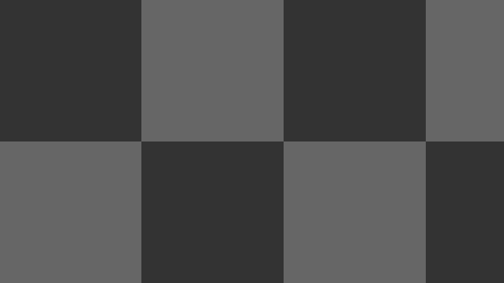|
|:--:|

To improve this check pattern, we also want to display alternating colors for
squares' diagonals. To achieve this task, we are going to draw another check
pattern above the first one with a 45° rotation. A common way to make a
[2D vectorial rotation](https://en.wikipedia.org/wiki/Rotation_(mathematics)#Two_dimensions)
is to define this function (`angle` parameter is in radians not in degrees):

```glsl
vec2 rotation(vec2 UV, float angle)
{
  return UV * mat2(cos(angle), -sin(angle),
                   sin(angle),  cos(angle));
}
```

Secondly, we need to find the number of squares with a size equal to the
diagonal length of a square from the first check pattern. Before computing
this, we need to find the size of a square from the second check pattern.
Thanks to the **Synchronize our viewports** part from the
[0. Setup](0_setup.md) section of this tutorial, we know that the viewport
vertical axis is equal to `1.0`. Hopefully for us the diagonal of the square
we are searching is equal this vertical axis (so it is equal to `1.0`):

|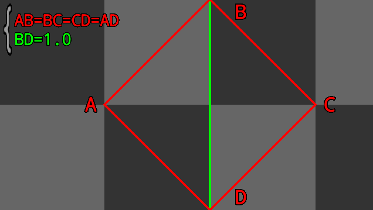|
|:--:|

Thanks to this information, now we should be able to compute the size of a
square from the second check pattern. For this we only need to apply
Pythagorean theorem on `ABD` isoceles right-angled triangle:

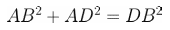

Because we know that: 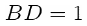

We can symplify this equation like this:

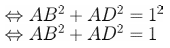

And because we know that: 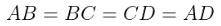

We can symplify this equation like this:

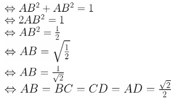

Then, we are going to divide the vertical size of our viewport (which is
`1.0`) by the size of a square from the second check pattern. We should find
the number of squares with a size equal to the diagonal length of a square
from the first check pattern:

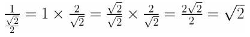

Finally we use this number to draw the second check pattern:

```glsl
void mainImage(out vec4 fragColor, in vec2 fragCoord)
{
  vec2 UV = fragCoord / iResolution.y;

  // 45° rotation
  UV = rotation(UV, 0.7853);

  // Number of squares with a size equal to the diagonal length of a square from the first check pattern
  float squares = sqrt(2.0);

  // Split UV cordinates system into squares
  vec2 truncated_UV = floor(UV * squares);

  // Check mathematic parity of the sum of the 2 axis of the truncated UV
  bool is_brighter = mod(truncated_UV.x + truncated_UV.y, 2.0) < 1.0;

  // If sum is odd, color is darker
  fragColor = vec4(vec3(0.2 + (is_brighter ? 0.2 : 0.0)), 1.0);
}
```

And we have this result:

|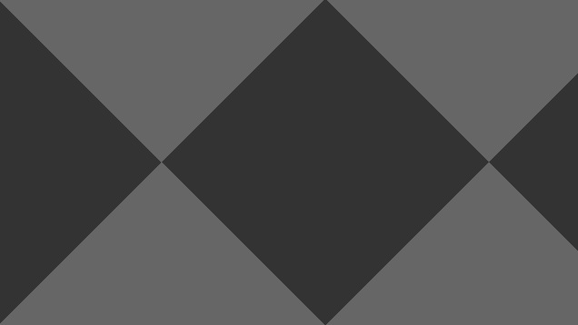|
|:--:|

Now we have to merge the two check patterns we previously drawn:

```glsl
void mainImage(out vec4 fragColor, in vec2 fragCoord)
{
  vec2 UV = fragCoord / iResolution.y;

  // First check pattern
  float squares = 2.0;
  vec2 truncated_UV = floor(UV * squares);
  bool is_brighter = mod(truncated_UV.x + truncated_UV.y, 2.0) < 1.0;

  // Second ckeck pattern
  squares = sqrt(2.0);
  UV = rotation(UV, 0.7853);
  truncated_UV = floor(UV * squares);
  bool is_brighter2 = mod(truncated_UV.x + truncated_UV.y, 2.0) < 1.0;

  // If sum1 is even OR sum2 is even, color is brighter
  fragColor = vec4(vec3(0.2 + (is_brighter || is_brighter2 ? 0.2 : 0.0)), 1.0);
}
```

But that is not really what we expected:

|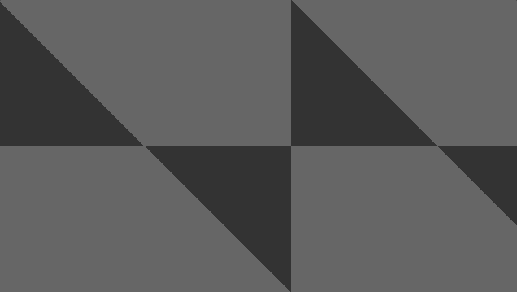|
|:--:|

This is happening because we are using OR boolean operator. When the two check
patterns are brighter, their intersection is also brighter. Because we want to
display alternating colors, this is not the behavior we are expecting. We only
want to display white if only one of the two check patterns is white. To
achieve this we need to use the XOR boolean operator.You need to replace those
lines:

```glsl
  // If sum1 is even OR sum2 is even, color is brighter
  fragColor = vec4(vec3(0.2 + (is_brighter || is_brighter2 ? 0.2 : 0.0)), 1.0);
```

with those lines:

```glsl
  // If sum1 is even XOR sum2 is even, color is brighter
  fragColor = vec4(vec3(0.2 + (is_brighter ^^ is_brighter2 ? 0.2 : 0.0)), 1.0);
```

And here we are, our check pattern is done:

|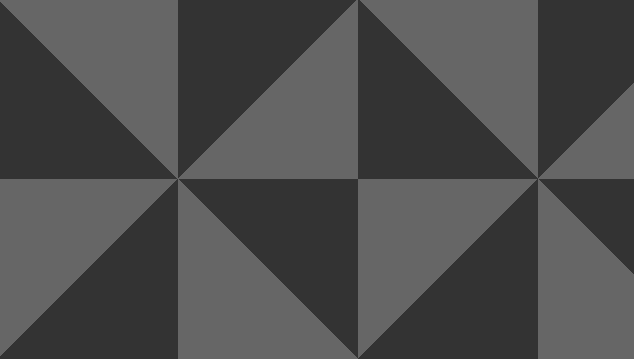|
|:--:|

---

[&#8882; Previous page - Shape the circles grid](1_5_shape_circles_grid.md) | [Next page - A swirl &#8883;](2_2_a_swirl.md)
---|---
