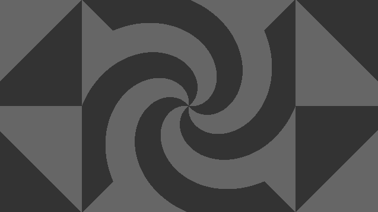
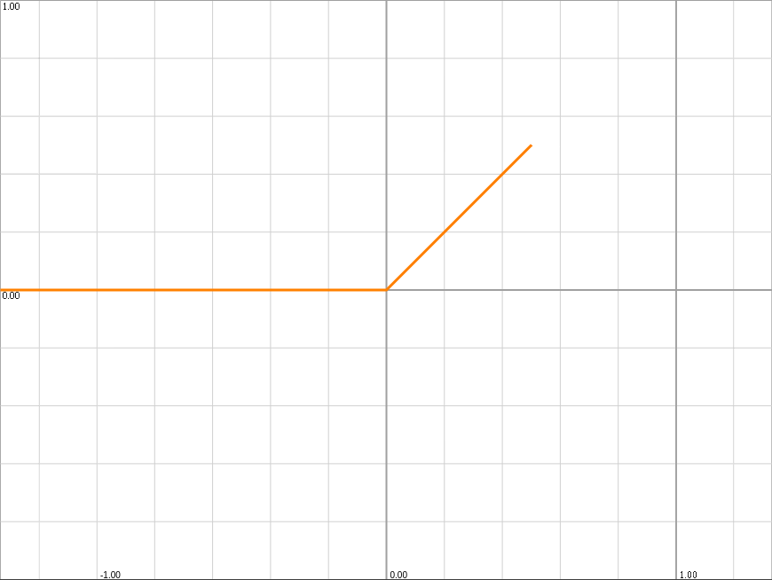
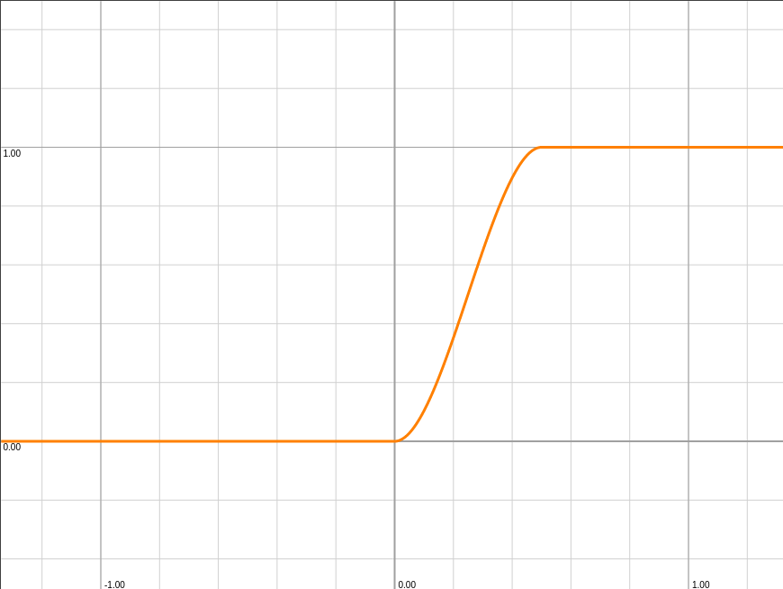
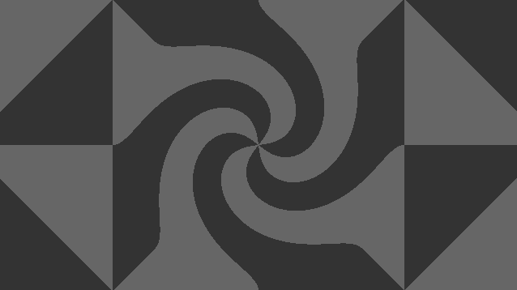

[&#8882; Previous page - Check pattern](2_1_check_pattern.md) | [Next page - Swirls grid &#8883;](2_3_swirls_grid.md)
---|---

---

# 2.2. A swirl

It is time to draw our first swirl. Because we are going to use swirls to
displace things we drawn, we are not really drawing them. We are going to
displace UV and then we will draw something (which will look swirly). For this
task we are going to use a function we already used before: the
`rotate(UV, angle)` function. I used this function in the
[2.1. Check pattern](2_1_check_pattern.md) section. If you did not follow this
section because you want to displace something you drawn by yourself, here the
function I am talking about:

```glsl
vec2 rotate(vec2 UV, float angle)
{
  return UV * mat2(cos(angle), -sin(angle),
                   sin(angle),  cos(angle));
}
```

If you have no idea how this function was built, here
[the Wikipedia page of the 2D vectorial rotation](https://en.wikipedia.org/wiki/Rotation_(mathematics)#Two_dimensions)
(Don't be afraid: unlike some other heavy maths article on Wikipedia, the
linked section of this Wikipedia page is short and maths are simple).
Reminder: `angle` parameter is quantified in radians (not in degrees).

Ok, now if we use this `rotate(UV, angle)` function, how to fill `UV` and
`angles` parameters ? For `UV`, we are going to use centered UV coordinates to
display our swirl. For `angle`, we have to give it the swirl angle, but how to
find it ? It depends of the shape of our swirl. Here we want to display a
circled swirl. So we are going to use the `length(v)` builtin function we used
before to draw circles (if you want an other shape for your swirl, you can use
any other
[signed distance function](https://iquilezles.org/articles/distfunctions2d/)
and adapt the script we are writting). Because we want that the nearer is a
point from the swirl's center, the more displaced it is, we have to revert the
`length(v)` returned value. But now the returned value is between `0.0` and
`-∞`. We have to add a value to increase the maximum returned value (which is
`0.0` right now). The greater will be this value, the greater will be the
swirl radius. Then we have to take care about negative values of the
`length(v)` returned value because an angle can be negative. For this we are
going to use the `max(x, y)` builtin function to keep the returned value to
`0.0` when a pixel is outside of the swirl. This is what the script looks:

```glsl
void mainImage(out vec4 fragColor, in vec2 fragCoord)
{
  vec2 UV = fragCoord / iResolution.y;

  // Centering the swirl (if you do not remember why we are doing this to
  // achieve this centering, we are following the same steps we did in 1.1.
  // section of this tutorial)
  UV -= 0.5 * iResolution.xy / iResolution.y;

  // Swirl radius
  float radius = 0.5;

  // Rotation angle of the circled swirl
  float rotation = max(radius - length(UV), 0.0);

  // Increase rotation for better visibility
  rotation *= 5.0;

  // Displace UV into a swirl
  UV = rotate(UV, rotation);

  // Check pattern: you can replace those lines by your own drawing
  float squares = 2.0;
  vec2 truncated_UV = floor(UV * squares);
  bool is_brighter = mod(truncated_UV.x + truncated_UV.y, 2.0) < 1.0;
  squares = sqrt(2.0);
  UV = rotate(UV, 0.7853);
  truncated_UV = floor(UV * squares);
  bool is_brighter2 = mod(truncated_UV.x + truncated_UV.y, 2.0) < 1.0;
  fragColor = vec4(vec3(0.2 + (is_brighter ^^ is_brighter2 ? 0.2 : 0.0)), 1.0);
}
```

And what you should see:

||
|:--:|

This swirl looks good but we can improve the result by a smoother result. For
this I am going to introduce a new builtin function: the
`smoothstep(a, b, v)`. This function:
- returns `0.0` if `v < a`,
- returns `1.0` if `v > b`,
- performs Hermite interpolation if `a < v < b` (it returns a value between
`0.0` and `1.0`).

What is our `a`, `b` and `v` parameters ? To define `a` and `b`, we need to
define `v` before (which is the value we want to interpolate). If we look at
our current `rotation` variable, the value we are trying to keep greater than
`0.0` is `radius - length(UV)`. So this is going to be our `v` parameter. Now
for `a` and `b` parameters, we have to wonder between which values we want to
keep `v`. For `a`, this is `0.0` (this is why we used `max()` function
before). For `b`, this is `radius` (because this is maximum value for `v`).

Here what our current swirl rotation function looks and what it looks with
`smoothstep(a, b, v)` function. On those plots, X-axis is
`radius - length(UV)`):

|||
|:--:|:--:|
|with Y-axis: `max(radius - length(UV), 0.0)`|with Y-axis: `smoothstep(0.0, radius, radius - length(UV))`|

Here, the adapted version of our script:

```glsl
void mainImage(out vec4 fragColor, in vec2 fragCoord)
{
  vec2 UV = fragCoord / iResolution.y;

  // Centering the swirl
  UV -= 0.5 * iResolution.xy / iResolution.y;

  // Swirl radius
  float radius = 0.5;

  // Smooth rotation angle of the circled swirl
  float rotation = smoothstep(0.0, radius, radius - length(UV));

  // Increase rotation for better visibility
  rotation *= sqrt(5.0);

  // Displace UV into a swirl
  UV = rotate(UV, rotation);

  // Check pattern: you can replace those lines by your own drawing
  float squares = 2.0;
  vec2 truncated_UV = floor(UV * squares);
  bool is_brighter = mod(truncated_UV.x + truncated_UV.y, 2.0) < 1.0;
  squares = sqrt(2.0);
  UV = rotate(UV, 0.7853);
  truncated_UV = floor(UV * squares);
  bool is_brighter2 = mod(truncated_UV.x + truncated_UV.y, 2.0) < 1.0;
  fragColor = vec4(vec3(0.2 + (is_brighter ^^ is_brighter2 ? 0.2 : 0.0)), 1.0);
}
```

And the expected result:

||
|:--:|

---

[&#8882; Previous page - Check pattern](2_1_check_pattern.md) | [Next page - Swirls grid &#8883;](2_3_swirls_grid.md)
---|---
