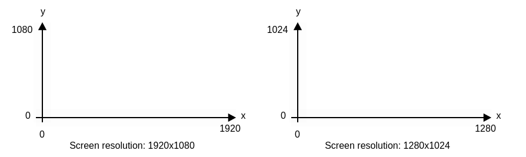
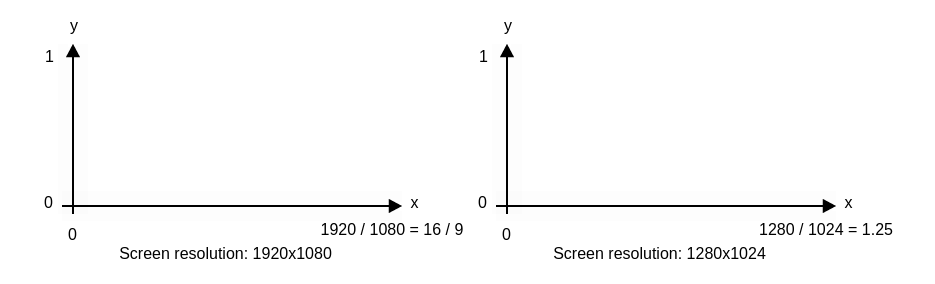

[&#8883; Next page: A circled light](1_1_a_circled_light.md)

---

# Setup

In this tutorial we will only write a fragment shader. We do not need any
other shader to make it. We will write this shader on
[Shadertoy](https://www.shadertoy.com/new). It is one of the online tool
letting you play interactively with WebGL 2.0 shaders. So you can get the same
result on you own *Shadertoy* session if you copy-paste the script I am
writing. There are very minor changes between Shadertoy's shaders and GLSL
shader. So it will not be hard to translate the final result in a GLSL shader.

## Synchronize our viewports

Here is our main function:
```
void mainImage(out vec4 fragColor, in vec2 fragCoord)
{
}
```
This function will be called for each pixel of our screen.
*fragColor* is the pixel color where each of its *vec4* channel match to a
RGBA channel. Each one of the *fragColor* channel has to be between *0.0* and
*1.0*. If a *fragColor* channel value is not in this interval, the visual
result is clamped. *fragColor* is the ouput of our fragment shader.
*fragCoord* is the pixel coordinates. So if your screen's resolution are
1920x1080, your first pixel coordinates are *(0.0, 0.0)* and your last pixel
coordinates are *(1919.0, 1079.0)*. *fragCoord* is the input of our fragment
shader.

As you can see, now our *mainImage()* function is empty. We have to fill it to
display something on screen.

The first step is to uniformize our coordinate system. Depending of your
screen, the coordinates system of your shader is not the same as mine. My
screen's resolution are 1920x1080 but maybe your screen's resolution are
1280x1024. We have to find a way to see the same thing on our screens. For
this reason we can't work with *fragCoord*, we have to translate this system
in UV system. The better way to achieve this, is to add this line in our
*mainImage()* function:
```
  vec2 UV = fragCoord / iResolution.y;
```
*iResolution* is a Shadertoy specific variable. It is defined as: "The
viewport resolution". So *iResolution.y* is our height resolution. So now
instead of this coordinate system:



We have this one:



And we have the same Y axis. Now we can start to draw something.

---

[&#8883; Next page: A circled light](1_1_a_circled_light.md)
